# ระบบ POS ร้านขายหลังคาเหล็ก — เอกสาร Requirement

> **สถานะ:** เอกสารนี้เป็น **As-Is (สภาพปัจจุบัน)** ที่ได้จากการ *reverse-engineer จากโค้ดที่มีอยู่จริง*
> ไม่ใช่ requirement ที่ออกแบบไว้ล่วงหน้า เพราะโปรเจกต์ **ยังไม่มีเอกสาร requirement ตั้งต้น**
> ใช้เป็นฐานเพื่อระบุ requirement ที่ชัดเจน (To-Be) ต่อไป
>
> 🔴 = จุดที่โค้ดปัจจุบันทำ "ผิดมาตรฐาน" หรือมีความเสี่ยง (ดูหัวข้อ Gap ท้ายเอกสาร)

---

## 1. ผู้เกี่ยวข้องกับระบบ (As-Is Actors & Context)

ระบบปัจจุบันมีผู้ใช้ 4 กลุ่ม แต่ **การคุมสิทธิ์ยังไม่สมบูรณ์**

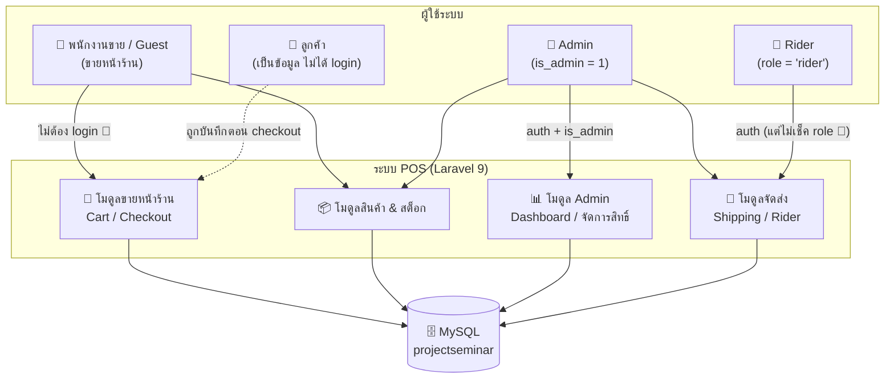

| Actor | วิธียืนยันตัวตนปัจจุบัน | สิ่งที่ทำได้ | ปัญหา |
|-------|----------------------|------------|-------|
| พนักงานขาย | **ไม่มี** (route เปิดโล่ง) | เปิดตะกร้า, ขาย, ตัดสต็อก | 🔴 ใครก็เข้าได้โดยไม่ login |
| Admin | `auth` + middleware `is_admin` | Dashboard, จัดการ user/สิทธิ์, สต็อก, จัดส่ง | โอเค |
| Rider | `auth` เท่านั้น | ดูออเดอร์, ยืนยันจัดส่ง, อัปโหลดรูป | 🔴 route ไม่เช็ค `role='rider'` |
| ลูกค้า | ไม่ login | ถูกบันทึกด้วยเบอร์โทรตอน checkout | 🔴 ผูกด้วยเบอร์ ไม่ใช่ id |

---

## 2. Flow การขายหน้าร้าน (As-Is Sale / POS Flow)

flow จริงตามที่โค้ดใน `CartController` ทำ — รวมจุดบกพร่องที่พบ

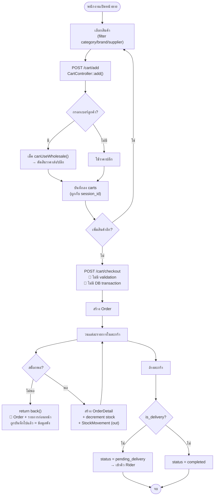

---

## 3. Flow การจัดส่ง (As-Is Delivery / Rider Flow)

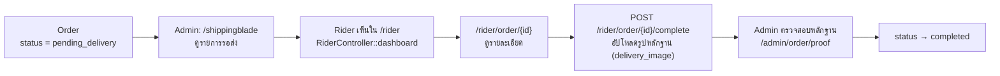

---

## 4. โครงสร้างข้อมูลปัจจุบัน (As-Is ERD)

ERD จากตารางและ relationship จริงในโค้ด (21 ตาราง แสดงเฉพาะแกนหลัก)

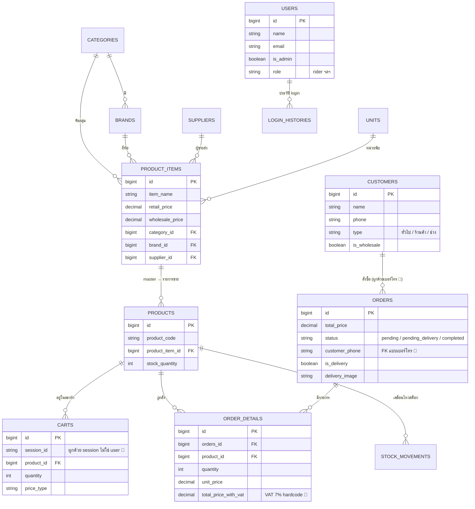

---

## 5. โมดูลในระบบปัจจุบัน (As-Is Module Map)

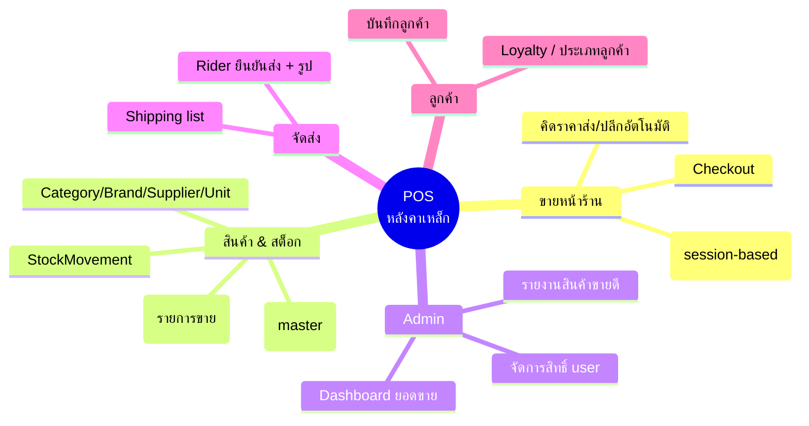

---

## 6. Gap Analysis — ทำไม requirement ถึง "ยังไม่ชัด"

ปัญหาที่ทำให้ระบบยัง**ไม่เป็นมาตรฐาน** และ requirement ยังไม่ครบ:

### 6.1 ความปลอดภัย / ความถูกต้องของข้อมูล (ร้ายแรง)
- 🔴 route ขาย/สต็อก (`/cart/checkout`, `/order/store`, `/stock/add`) **เปิดโล่งไม่ต้อง login**
- 🔴 `checkout()` **ไม่มี DB transaction** → ถ้าสต็อกไม่พอกลางคัน จะเกิดออเดอร์ผี + สต็อกถูกหักทิ้ง
- 🔴 check-then-decrement สต็อก ไม่ atomic → **ขายเกินจำนวน** ได้เมื่อขายพร้อมกัน
- 🔴 แทบไม่มี input validation (qty ติดลบ/ค่าเกินก็ผ่าน)

### 6.2 สถาปัตยกรรม
- ไม่มี Service / Repository layer — business logic ยัดใน controller
- ไม่มี Form Request — validation กระจัดกระจาย
- VAT 7% hardcode (`1.07`) แทนที่จะเก็บใน setting
- ระบบสิทธิ์ใช้แค่ boolean/string ไม่มี Policy/Gate

### 6.3 ประสบการณ์ใช้งาน (UI/UX)
- 🔴 **ไม่มี pagination เลยทั้งโปรเจกต์** — ทุกหน้า list ดึงทั้งตาราง
- Layout 4 ตัวตีกัน (`app` / `sidebar` / `adminside` / `product2`) → หน้าตาไม่สม่ำเสมอ
- ไม่มี Blade component / `@include` เลย → ไม่มีการ reuse
- CSS ฝัง `<style>` ใน 25/46 view → สไตล์เพี้ยนกันแต่ละหน้า

### 6.4 ความสมบูรณ์ของเอกสาร
- ไม่มี Functional / Non-functional requirement ที่เขียนไว้
- ไม่มีนิยาม actor / สิทธิ์ที่ชัดเจน
- ไม่มี state ของ order ที่นิยามครบ (มี pending, pending_delivery, completed ปนกันในโค้ด)
- ไม่มีเทสยืนยันว่า flow ทำงานถูก (มีแค่ ExampleTest)

---

## 7. ข้อเสนอสิ่งที่ requirement (To-Be) ควรระบุให้ชัด

1. **นิยาม actor + สิทธิ์** ให้ครบ (พนักงานขายต้อง login, rider ต้องเช็ค role)
2. **นิยาม state ของ order** เป็น state machine ที่ชัดเจน
3. **Non-functional:** รองรับข้อมูลกี่แถว, ต้องมี pagination, เวลาตอบสนอง
4. **กฎธุรกิจ:** เงื่อนไขราคาส่ง/ปลีก, VAT, loyalty ให้เขียนเป็นข้อกำหนด ไม่ใช่ฝังในโค้ด
5. **ความปลอดภัย:** ทุก transaction เงิน/สต็อกต้อง atomic + auth

> ขั้นถัดไป: เมื่อยืนยัน As-Is นี้แล้ว ดู **To-Be (ระบบที่เสนอ)** ด้านล่างเพื่อเห็นว่าต้องปรับตรงไหนบ้าง

---
---

# 🎯 To-Be — ระบบ POS ที่เสนอ (Proposed System)

> ส่วนนี้คือ **ข้อเสนอการยกระดับระบบ** จาก As-Is ให้เป็นมาตรฐาน
> 🟢 = จุดที่ปรับปรุงจากของเดิม (แก้ 🔴 ใน As-Is)

---

## 8. ภาพรวมสถาปัตยกรรมที่เสนอ (To-Be Architecture)

เปลี่ยนจาก "logic ยัดใน controller" เป็นสถาปัตยกรรมแบบมี layer ชัดเจน

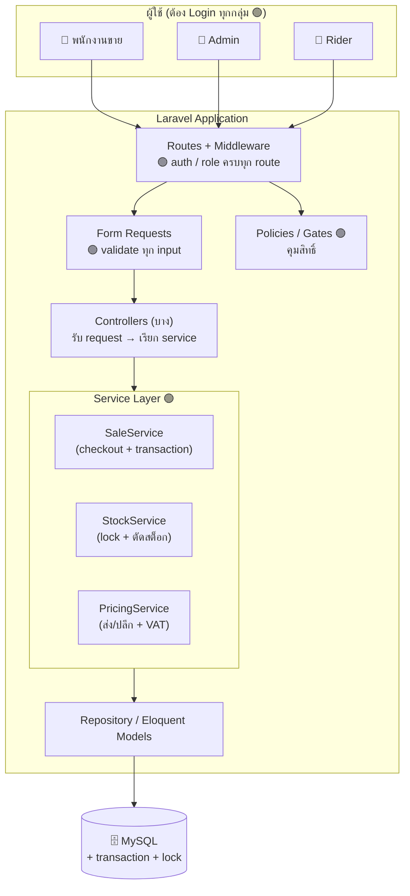

---

## 9. Flow การขายที่เสนอ (To-Be Sale Flow)

แก้ปัญหา As-Is: ต้อง login, มี validation, ห่อ transaction, ล็อกสต็อก

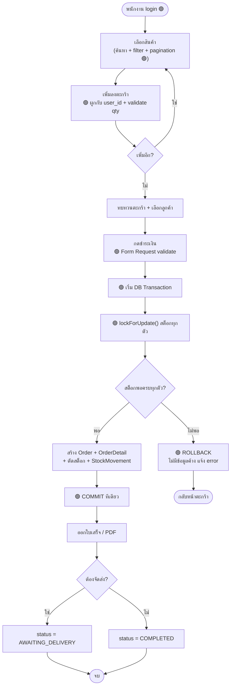

---

## 10. State ของ Order ที่เสนอ (To-Be Order State Machine)

นิยาม state ให้ชัด (As-Is มี status ปนกันในโค้ด)

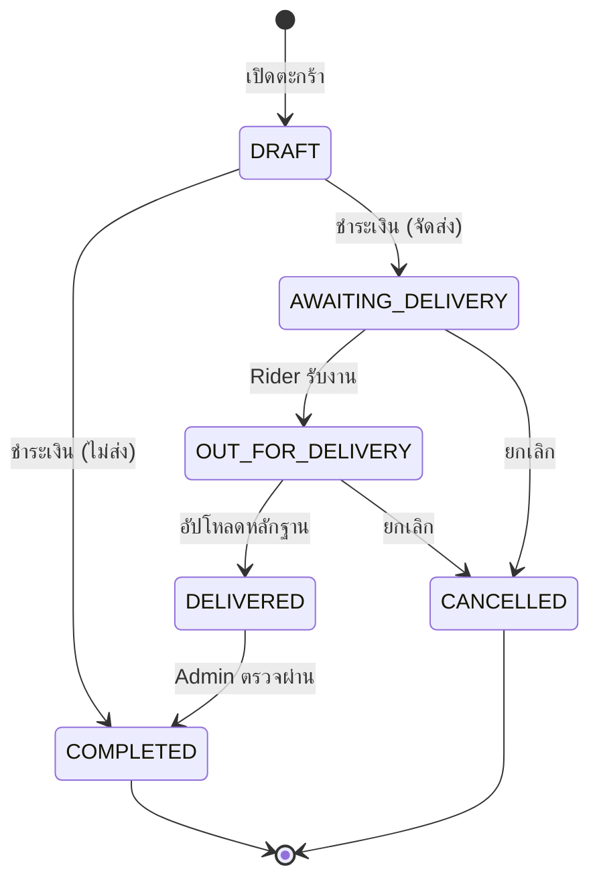

---

## 11. สิทธิ์การใช้งานที่เสนอ (To-Be Role & Permission)

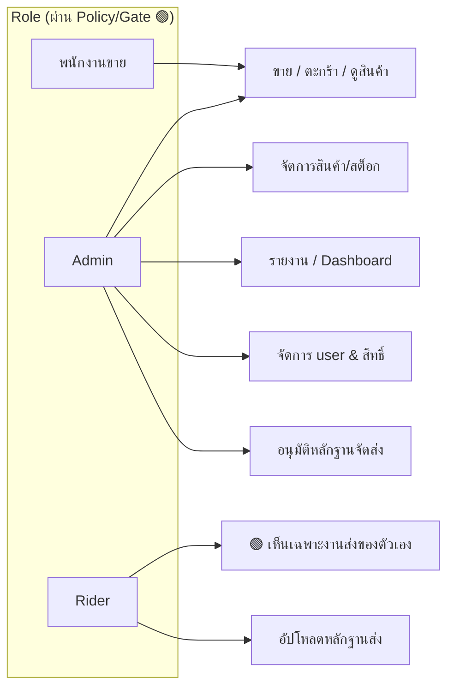

| Role | เข้าถึงได้ | ปรับจาก As-Is |
|------|-----------|---------------|
| พนักงานขาย | POS, ตะกร้า, ดูสินค้า | 🟢 บังคับ login (เดิมเปิดโล่ง) |
| Admin | ทุกอย่าง + จัดการระบบ | คงเดิม แต่ใช้ Policy |
| Rider | เฉพาะงานส่งของตัวเอง | 🟢 เช็ค role + เห็นเฉพาะงานตัวเอง |

---

## 12. ERD ที่เสนอ (To-Be — จุดที่ปรับ)

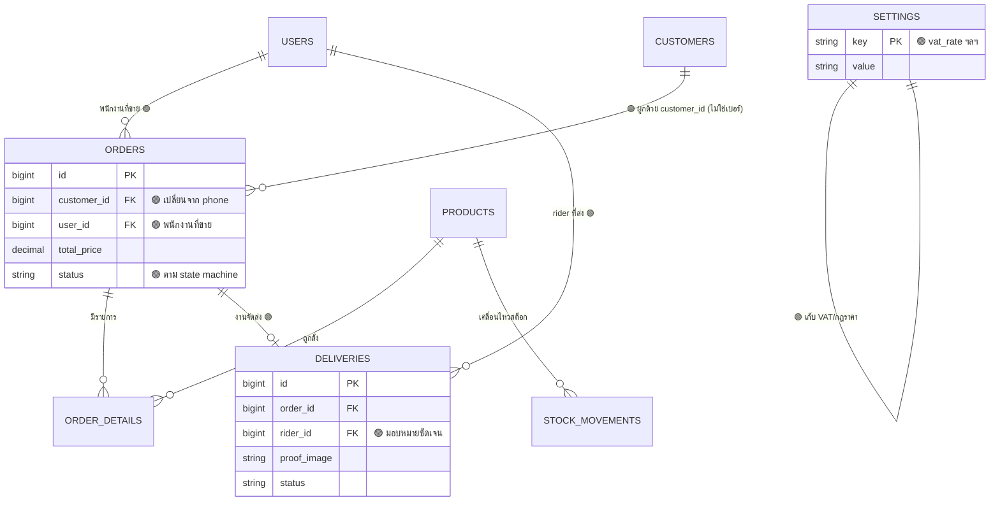

---

## 13. UI/UX ที่เสนอ (To-Be Frontend)

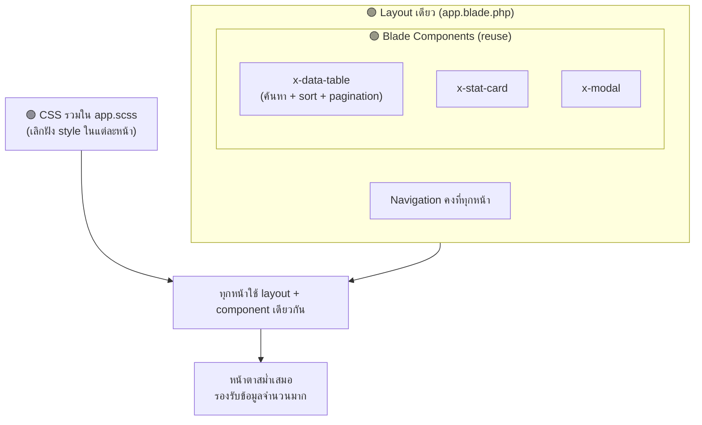

**สิ่งที่ต้องมีในทุกหน้ารายการ (🟢 แก้จาก As-Is):**
- **Pagination** — `->paginate(20)` + `{{ $items->links() }}` ทุกหน้า
- **ค้นหา / กรอง / เรียงลำดับ** เป็นมาตรฐาน
- **Layout เดียว** + Blade component ที่ reuse ได้
- CSS รวมศูนย์ใน `app.scss`

---

## 14. สรุปเปรียบเทียบ As-Is ↔ To-Be (สไลด์เสนอน้องๆ)

| หัวข้อ | As-Is (ปัจจุบัน 🔴) | To-Be (ที่เสนอ 🟢) |
|--------|---------------------|---------------------|
| **ความปลอดภัย** | POS เปิดโล่งไม่ต้อง login | login + Policy/Gate ทุก role |
| **ความถูกต้องข้อมูล** | ไม่มี transaction, สต็อกพังได้ | DB transaction + lockForUpdate |
| **Validation** | มีบ้างไม่มีบ้าง | Form Request ทุก endpoint |
| **สถาปัตยกรรม** | logic ยัดใน controller | Service layer แยกชัด |
| **กฎธุรกิจ (VAT/ราคา)** | hardcode ในโค้ด | เก็บใน settings |
| **Pagination** | ไม่มีเลย | ทุกหน้ารายการ |
| **UI/Layout** | 4 layout ตีกัน, ไม่ reuse | layout เดียว + component |
| **Order status** | ปนกันในโค้ด | state machine ชัดเจน |
| **เอกสาร/เทส** | ไม่มี | requirement + unit test |

---

## 15. แผนดำเนินการที่เสนอ (Roadmap เสนอน้องๆ)

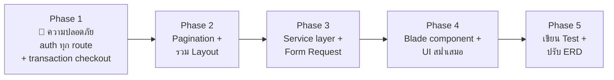

> **ลำดับความสำคัญ:** Phase 1 (ความปลอดภัย + ความถูกต้องข้อมูล) ต้องทำก่อนเสมอ
> เพราะเป็นเรื่องที่ทำให้ "ระบบเงิน/สต็อกเชื่อถือได้" — ที่เหลือคือยกระดับคุณภาพและประสบการณ์ใช้งาน

---
---

# 16. Activity Diagram ระดับธุรกิจ (Business Activity)

> ส่วนนี้อธิบาย **กระบวนการทำงานจริงของร้าน** ว่าใครทำอะไร ก่อน-หลังอย่างไร
> เขียนในภาษาธุรกิจล้วน ๆ (ไม่พูดถึงหน้าจอ ฐานข้อมูล หรือวิธีเขียนโปรแกรม)
> เพื่อใช้ยืนยันกับเจ้าของร้านว่า "เข้าใจงานตรงกัน" ก่อนจะออกแบบระบบ

| # | กระบวนการ | ผู้เกี่ยวข้อง | ไฟล์แยก |
|---|-----------|-------------|---------|
| B-1 | ขายหน้าร้าน | ลูกค้า, พนักงานขาย | `mermaid/04-activity-sale.mmd` |
| B-2 | จัดส่งสินค้า | เจ้าของร้าน, พนักงานส่งของ, ลูกค้า | `mermaid/05-activity-delivery.mmd` |
| B-3 | รับสินค้าเข้าร้าน | ผู้ขายส่ง, เจ้าของร้าน | `mermaid/06-activity-stock-in.mmd` |
| B-4 | ยกเลิกรายการขาย & คืนเงิน | ลูกค้า, พนักงานขาย, เจ้าของร้าน | `mermaid/07-activity-cancel-refund.mmd` |

ภาพรวมทั้งกระบวนการรวมอยู่ในไฟล์เดียวที่ `bpmn/business-process-sale-and-delivery.bpmn`

---

## B-1 — ขายหน้าร้าน

**เริ่มเมื่อ:** ลูกค้าเข้ามาถามซื้อสินค้า
**เงื่อนไขก่อนเริ่ม:** ร้านมีข้อมูลสินค้าและราคาที่ตั้งไว้แล้ว
**ผลลัพธ์ที่ต้องได้:** ลูกค้าได้สินค้าหรือได้นัดส่ง, ร้านได้เงิน, มีใบเสร็จ และจำนวนสินค้าคงเหลือลดลงตามที่ขายจริง
**กรณียกเว้น:** สินค้าไม่พอ → เสนอทางเลือกหรือจบโดยไม่เกิดการซื้อขาย

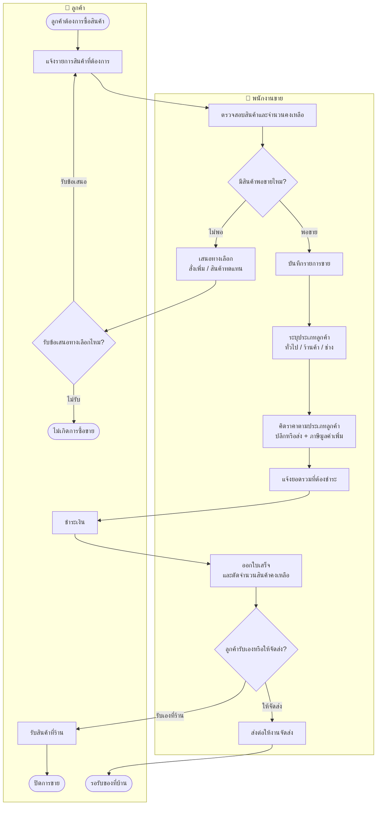

---

## B-2 — จัดส่งสินค้า

**เริ่มเมื่อ:** ลูกค้าชำระเงินแล้วและขอให้จัดส่ง
**เงื่อนไขก่อนเริ่ม:** มีพนักงานส่งของที่ว่างรับงาน
**ผลลัพธ์ที่ต้องได้:** ลูกค้าได้รับของ มีหลักฐานการส่งที่เจ้าของร้านตรวจแล้ว และรายการขายถูกปิด
**กรณียกเว้น:** ส่งไม่สำเร็จ → นัดส่งใหม่ หรือยกเลิกและคืนเงิน (ไปต่อ B-4)

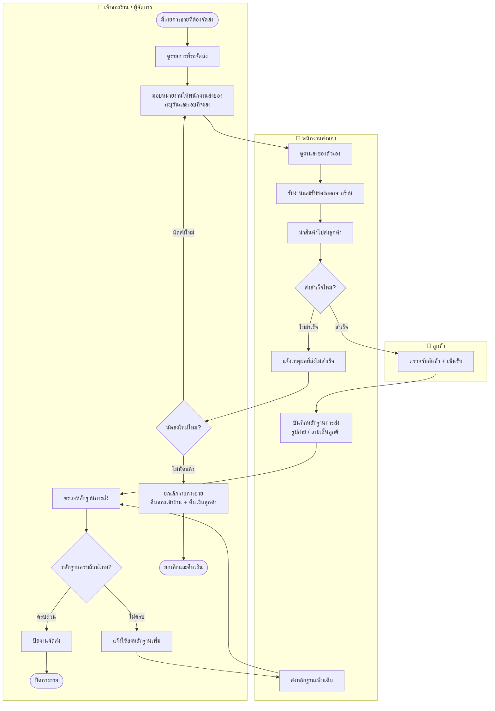

---

## B-3 — รับสินค้าเข้าร้าน

**เริ่มเมื่อ:** ผู้ขายส่งนำสินค้ามาส่งที่ร้านพร้อมใบส่งของ
**เงื่อนไขก่อนเริ่ม:** มีคำสั่งซื้อหรือข้อตกลงกับผู้ขายส่งไว้แล้ว
**ผลลัพธ์ที่ต้องได้:** จำนวนคงเหลือในระบบตรงกับของจริงในร้าน และรู้ต้นทุนของล็อตนั้น
**กรณียกเว้น:** ของขาด / ของเสีย → แจ้งผู้ขายส่งและรับเข้าเฉพาะจำนวนที่รับจริง

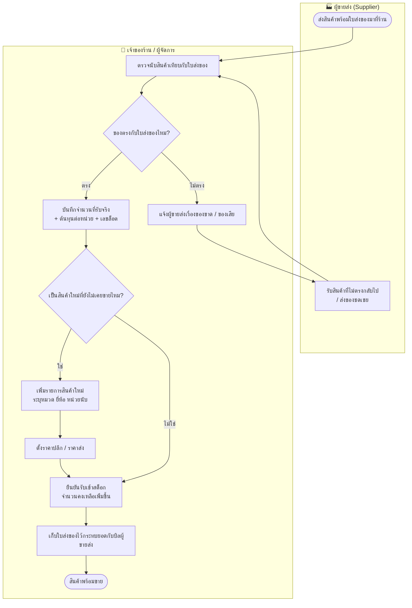

---

## B-4 — ยกเลิกรายการขาย & คืนเงิน

**เริ่มเมื่อ:** ลูกค้าขอยกเลิกหรือคืนสินค้า / ส่งไม่สำเร็จและไม่นัดส่งใหม่
**เงื่อนไขก่อนเริ่ม:** ยังไม่ปิดการขาย หรือสินค้ามีปัญหาตามเงื่อนไขที่ร้านกำหนด
**ผลลัพธ์ที่ต้องได้:** ลูกค้าได้เงินคืน สินค้ากลับเข้าสต็อก และยอดขายถูกตัดออกจากรายงาน
**กรณียกเว้น:** ไม่เข้าเงื่อนไข → เสนอทางเลือกอื่นแทน เช่น เปลี่ยนสินค้า

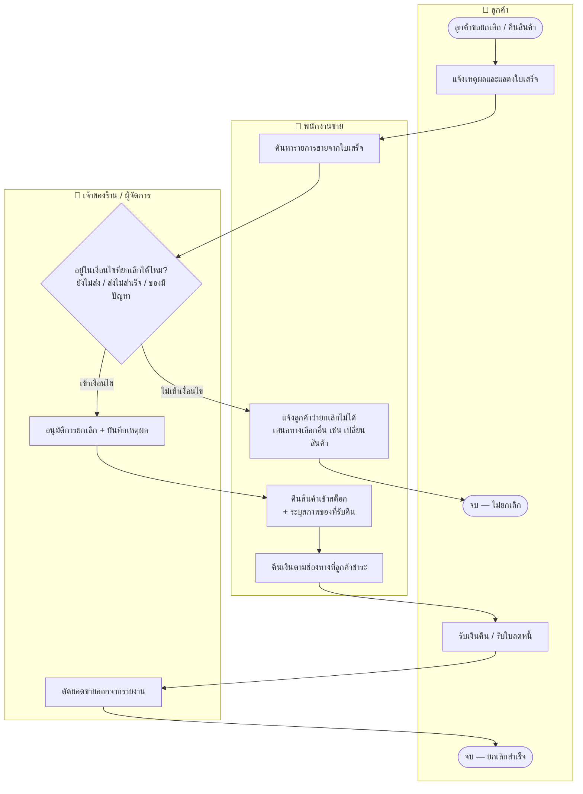

---

# 17. กฎธุรกิจที่ต้องตกลงให้ชัด

กฎพวกนี้คือสิ่งที่ต้องถามเจ้าของร้านให้ได้คำตอบ ก่อนเริ่มออกแบบระบบ

## 17.1 การคิดราคา

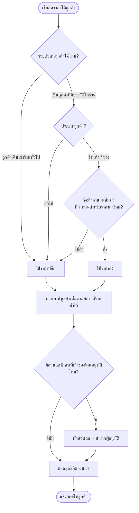

| รหัส | กฎ | สิ่งที่ต้องเคาะให้ชัด |
|------|-----|---------------------|
| BR-01 | ใครได้ราคาส่ง | ลูกค้าประเภทไหนบ้าง และต้องซื้อขั้นต่ำเท่าไรถึงได้ราคาส่ง |
| BR-02 | ภาษีมูลค่าเพิ่ม | อัตราปัจจุบันเท่าไร และถ้าเปลี่ยนต้องแก้ได้เองโดยไม่ต้องแก้โปรแกรม |
| BR-03 | ส่วนลดพิเศษ | ใครอนุมัติได้ ลดได้สูงสุดเท่าไร ต้องบันทึกผู้อนุมัติไหม |
| BR-04 | ขายเกินจำนวนที่มี | ถ้าของไม่พอ อนุญาตให้รับออเดอร์ค้างส่งไหม หรือห้ามขายเด็ดขาด |

## 17.2 การขายและการส่งมอบ

| รหัส | กฎ | สิ่งที่ต้องเคาะให้ชัด |
|------|-----|---------------------|
| BR-05 | ค่าจัดส่ง | คิดตามระยะทาง / ยอดซื้อ / ฟรีเมื่อถึงยอดเท่าไร |
| BR-06 | หลักฐานการส่ง | ต้องมีอะไรบ้างถึงถือว่าส่งครบ (รูปสินค้า, ลายเซ็น, ชื่อผู้รับ) |
| BR-07 | ส่งไม่สำเร็จ | นัดใหม่ได้กี่ครั้ง ก่อนจะถือว่ายกเลิก |
| BR-08 | ปิดการขาย | ใครเป็นคนปิด และปิดแล้วแก้ไขย้อนหลังได้หรือไม่ |

## 17.3 การยกเลิกและคืนสินค้า

| รหัส | กฎ | สิ่งที่ต้องเคาะให้ชัด |
|------|-----|---------------------|
| BR-09 | ช่วงเวลาที่ยกเลิกได้ | ยกเลิกได้ถึงขั้นตอนไหน หลังรับของแล้วคืนได้กี่วัน |
| BR-10 | สภาพสินค้าที่รับคืน | ของที่ตัดแล้ว / ของสั่งพิเศษ รับคืนไหม |
| BR-11 | วิธีคืนเงิน | คืนเป็นเงินสด / โอน / เครดิตไว้ซื้อครั้งหน้า |
| BR-12 | ผู้มีอำนาจอนุมัติ | พนักงานขายอนุมัติเองได้ไหม หรือต้องเจ้าของร้านเท่านั้น |

## 17.4 ลูกค้าและสินค้าคงคลัง

| รหัส | กฎ | สิ่งที่ต้องเคาะให้ชัด |
|------|-----|---------------------|
| BR-13 | การระบุตัวลูกค้า | ใช้อะไรเป็นตัวระบุ และลูกค้าคนเดิมที่เปลี่ยนเบอร์ต้องยังเป็นคนเดิม |
| BR-14 | แต้มสะสม / เครดิตร้านค้า | มีไหม คิดอย่างไร ใช้ได้กับอะไรบ้าง |
| BR-15 | การตรวจนับสต็อก | นับจริงถี่แค่ไหน และถ้าไม่ตรงกับระบบใช้ตัวไหนเป็นหลัก |
| BR-16 | จุดสั่งซื้อเพิ่ม | เหลือเท่าไรถึงต้องเตือนให้สั่งของเข้าร้าน |
